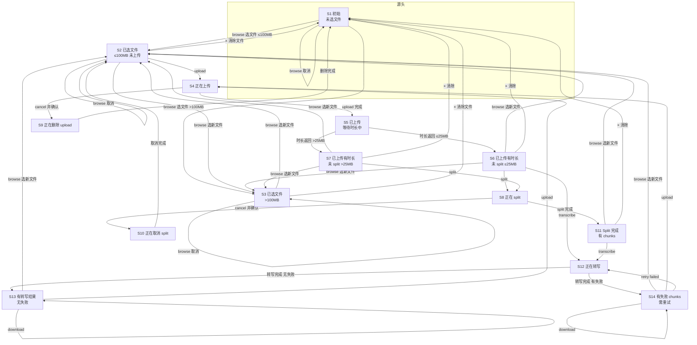

# Transcribe and Translate 业务流程图

## 流程图说明

- **节点**：每个方框为一个业务状态，框内为状态简称。
- **箭头**：箭头上的文字为「用户操作」，箭头指向操作后的下一状态。
- **同一操作可能因用户选择进入不同状态**（如 browse 选文件 ≤100MB → S2，选 >100MB → S3，取消 → 保持当前状态）。
- **状态详情**（browse / upload / split / transcribe / download、MB:%、chunks、Tasks、transcribe 文本等）见下方「状态详情表」。

---

## 业务流程图（Mermaid）

---

## 状态详情表

每个状态下的按钮、MB:%、chunks、Tasks、transcribe 文本等以当前实现为准，见下表。

| 状态 ID | 状态名称 | browse | upload | split | transcribe | download | MB:% 实际展示 | chunks 实际展示 | Tasks information | transcribe 文本 |
|--------|----------|--------|--------|-------|------------|----------|----------------|-----------------|-------------------|----------------|
| S1 | 初始（未选文件） | 启用 | 禁用 | 禁用 | 禁用 | 禁用 | MB:% | chunks | Tasks information | 否 |
| S2 | 已选文件≤100MB未上传 | 启用 | 启用 | 禁用 | 禁用 | 禁用 | 数字+MB:% | chunks | Tasks information | 否 |
| S3 | 已选文件>100MB | 启用 | 禁用 | 禁用 | 禁用 | 禁用 | >100+MB:% | chunks | Tasks information | 否 |
| S4 | 正在上传 | 禁用 | 启用(cancel) | 禁用 | 禁用 | 禁用 | 数字+MB: 进度% | chunks | Tasks information | 否 |
| S5 | 已上传等待时长中 | 禁用 | 禁用 | 禁用 | 禁用 | 禁用 | 数字+MB: 100% | … chunks | Tasks information | 否 |
| S6 | 已上传有时长未split(≤25MB) | 启用 | 禁用 | 启用 | 启用 | 禁用 | 数字+MB: 100% | 0/段数 chunks | Tasks information | 否 |
| S7 | 已上传有时长未split(>25MB) | 启用 | 禁用 | 启用 | 禁用 | 禁用 | 数字+MB: 100% | 0/段数 chunks | Tasks information | 否 |
| S8 | 正在 split | 禁用 | 禁用 | 启用(cancel) | 视≤25MB启用 | 禁用 | 数字+MB: 100% | 当前/总数 chunks | Tasks information | 否 |
| S9 | 正在删除 upload(确认后) | 禁用 | 禁用(del…) | 禁用 | 禁用 | 禁用 | 数字+MB: 100% | 0/N 或 … chunks | Tasks information | 否 |
| S10 | 正在取消 split(确认后) | 禁用 | 禁用 | 禁用(del…) | 禁用 | 禁用 | 数字+MB:% | chunks | Tasks information | 否 |
| S11 | Split 完成(有 chunks) | 启用 | 禁用 | 禁用 | 启用 | 禁用 | 数字+MB:% | N/N chunks | Tasks information | 否 |
| S12 | 正在转写 | 禁用 | 禁用 | 禁用 | 禁用 | 禁用 | chunks 路径: 数字+MB:%；单文件: 数字+MB: 100% | N/N 或 0/N chunks | 有 chunk 进度为当前文件名否则 Transcribing… | 否 |
| S13 | 有转写结果无失败 | 启用 | 启用 | 禁用 | 禁用 | 启用 | 数字+MB:% | chunks | Tasks information | 是 |
| S14 | 有失败 chunks 需重试 | 启用 | 启用 | 禁用 | 启用(retry failed) | 启用 | 数字+MB:% | chunks | Tasks information | 是（局部结果） |

---

## 转移说明（补充）

- **S5 → S6 / S7**：由服务端返回时长后自动进入，无需用户点击；按文件是否 >25MB 进入 S6 或 S7。
- **S4 → S5**：上传请求成功并返回后自动进入。
- **S8 → S11**：split 流式接口返回完整 chunks 后，前端 `onSuccess` 进入。
- **S12 → S13 / S14**：转写接口返回后，按是否有 `failed_chunk_ids` 进入 S13 或 S14。
- **S14 → S4（点 upload）**：会先对当前 `failedChunkIds` 逐个 `deleteUpload`，并清空 failed 相关状态，再开始上传，因此 retry 入口消失、transcribe 变为禁用状态的「transcribe」。
- **browse 选新文件**：从 S2/S3/S6/S7/S11/S13/S14 选新文件且未取消时，会进入 S2（≤100MB）或 S3（>100MB）；从 S11/S13/S14 选新文件时还会清空或删除当前 chunks/转写结果（见 handleFileChange / handleClear）。

以上流程图与状态表与当前前端逻辑一致，若代码后续有改动，需同步更新本文档。
